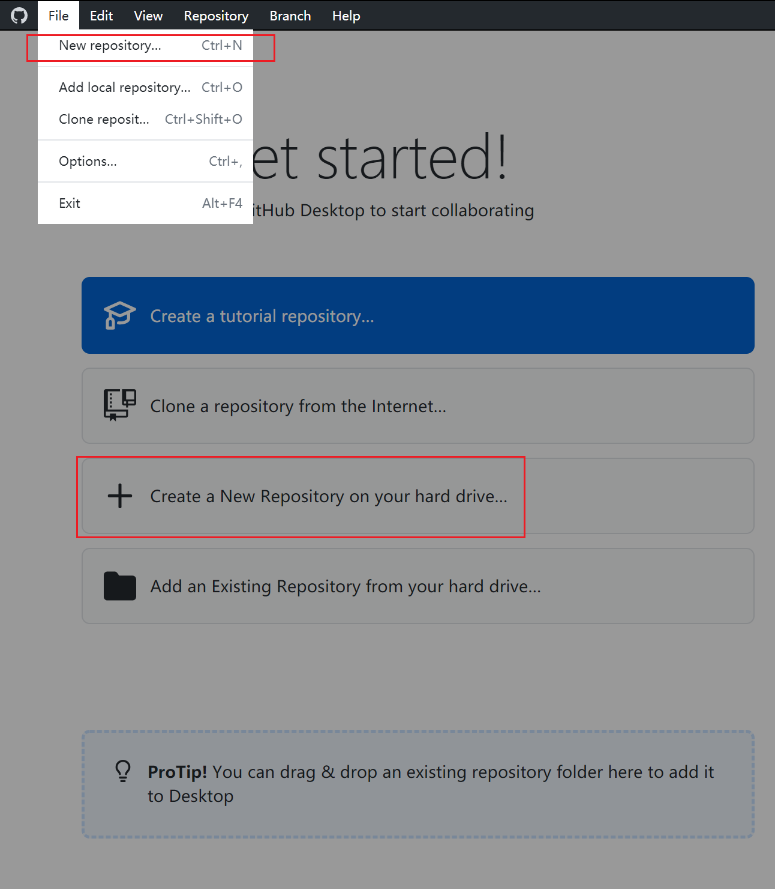
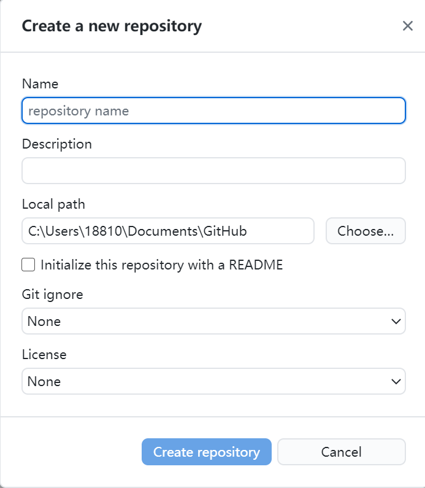
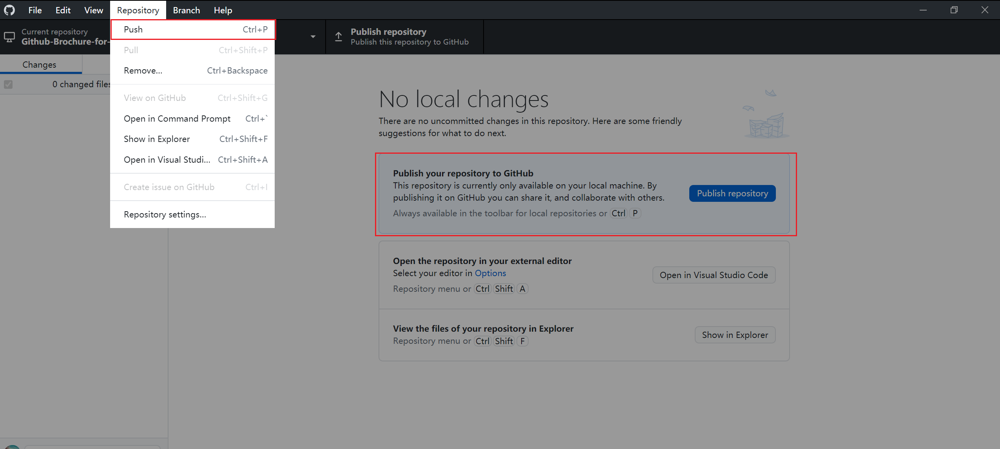
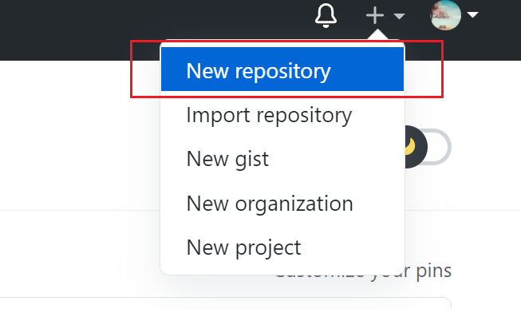
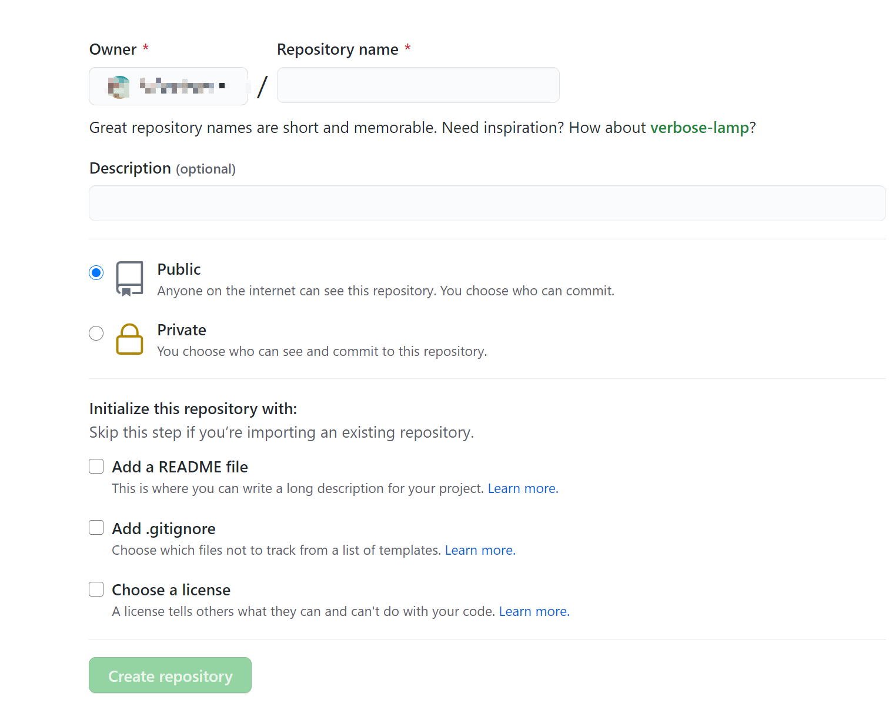

# 创建第一个仓库

## 什么是仓库
一般来说，我们开发一个文档，会把有关这个文档的所有内容，用到的资源，保存在一个地方。一个仓库就是一个这样的文件夹，这个文件夹中保存了你写的markdown文件，保存了你需要用到的图片，音频视频等等。他就相当于一个大的项目文件夹。Github中每一个仓库就对应了一个项目文件夹。而我们对项目的创建，更新，删除，都是使用仓库（repositorie）作为单位的。
## 创建本地仓库并推送到远程
我们知道，Github有点像远程的网盘。自然而然地，我们可以想创建一个项目的时候会想到先在本地新建文件夹，然后再上传到云端。  
这当然是一个正确的思路，但是Github仓库虽然表现为一个文件夹，但是它有自己的配置文件，不是任何时候创建的文件夹都可以成为一个仓库，可以直接提交到远程服务器。我们使用Github Desktop帮助我们完成这个过程。  
首先打开GithubDesktop  
  
找到选项New Repository或者Create a New Repository on your hard drive...点击。  
  
按照提示填写仓库名和仓库在本地的存储位置。  
完成后，一个初始化完成的本地仓库就创建好了。  
但是，这时候的仓库只存在于本地，而不存在于云端，所以我们选择push选项将仓库推送至云端。     
   
这样，在Github服务器上和本地都有一份项目的文件夹了。    
以后，你每次提交以后推送都会让远程的仓库和你本地的仓库保持一次同步更新。这样你在任何地方都能继续你的工作，而不是仅仅局限于你存储项目文件的电脑。  

## 创建远程仓库并从本地拉取
你当然也可以在远程的网盘创建一个项目文件夹，然后把这个文件夹下载到本地来！
访问Github官网并登录。
找到创建仓库的按钮。填写相关信息后创建。

创建完成后进入仓库，点击Code按钮可以发现。

## 个人文档开发的一般操作