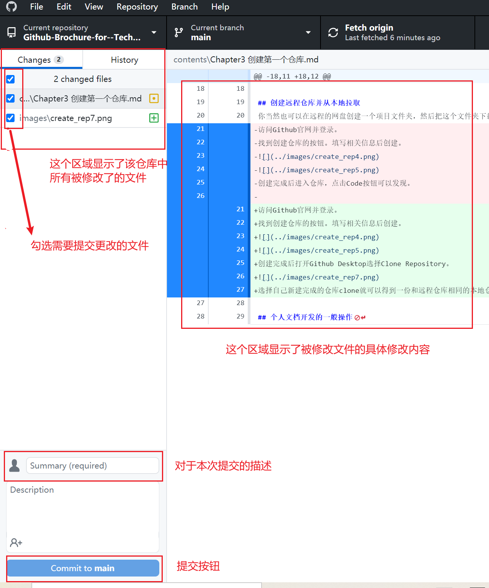

# GitHub基本操作
## 提交到本地分支
不同于传统文档开发流程中的做法，在GitHub中，对仓库的修改是一件非常重要严肃的事情，我们的每一次修改都需要被记录下来，这样我们就可以随时找到我们之前的想法，随时让仓库恢复之前的状态。在我们对代码进行修改的时候，我们并不能完全依赖软件自动帮我们记录所有的东西，那样会增加许多无聊而又烦杂的数据。所以，Git把这个自主权交给了我们。我们在完成一个阶段的工作以后，可以选择把自己认为有用的所有修改（包括你增加的内容和删除的内容）记录下来，我们把这个过程叫做提交（commit）。你当然可以每修改一次就提交一次，但是会很累。建议每次工作结束时提交，或者在进行重要的工作时频繁提交。   
  
在GitHub Desktop中，你的每次修改都被详细地显示出来。在提交之前，你需要勾选出需要提交的文件，一般来说我们会把所有的文件都选上，避免遗漏。但是这个区域存在的目的是为了告诉你，你是你作品的主宰，你决定着哪些修改会被提交。  
勾选出需要提交的文件后，在Summary的选项框中，填写本次提交的概述，最后点击Commit按钮，这样就可以把本次所有的修改提交到分支上了。  
这里我们暂时不用对分支进行什么操作，所以我们把分支放到最后解释。  
## 提交到远程分支

## 什么是分支
